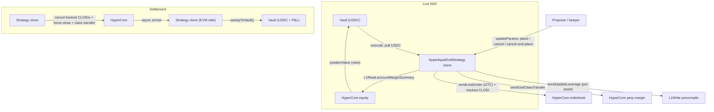

The `HyperliquidGridStrategy` lets a syndicate run a grid-trading book across whitelisted Hyperliquid perp assets. USDC is pulled from the vault and parked on HyperCore margin via the `L1Write` precompile. A keeper EOA (the proposer) drives the grid by calling `updateParams` every ~60s with batched limit orders. The strategy keeps an on-chain mirror of every resting GTC CLOID it has placed, so settlement can self-cancel without keeper assistance.

HyperEVM mainnet only.

<Warning>
  This strategy holds leveraged perp positions on a centralized-matching venue. A run-away market or keeper outage can leave grids one-sided; HyperCore liquidations destroy vault equity up to the deposit. Use conservative `leverage`, set per-order and per-tick caps at init, and monitor positions directly on Hyperliquid.
</Warning>

## Architecture



## Lifecycle

```
Pending → execute() → finalizeForHyperCore() → Executed → (place/cancel ticks) → settle() → Settled → sweep
```

| Phase | What happens | Who calls |
|-------|-------------|-----------|
| **Execute** | Pull USDC → set per-asset leverage on HyperCore → `sendUsdClassTransfer` to perp margin | Governor (proposal execution) |
| **Finalize-for-HyperCore** | One-time `finalizeForHyperCore(0, Create, deployerNonce)` so HC auto-credits ERC-20 USDC transfers to this clone's spot account. The CLI runs it as a separate tx immediately after `initialize()`. | Proposer |
| **Executed** | Keeper calls `updateParams` with one of: place batch of GTC orders, cancel a list of CLOIDs, atomic cancel-and-place. Each order's CLOID is tracked in `_liveCloids[ai]`. | Proposer only |
| **Live NAV** | While Executed, `positionValue()` reads HyperCore `accountValue` so the vault stays open at fair NAV. New deposits forward via `onLiveDeposit` → another `sendUsdClassTransfer` to perp margin. | Vault (read) |
| **Settle** | Walk every tracked CLOID and cancel, then force-close all asset positions (reduce-only IOC at min/max price), then request async USD transfer back to spot. | Governor |
| **Sweep** | `sweepToVault()` pushes USDC to the vault when async transfer arrives. Repeatable for partial arrivals. `initiateReturn()` is permissionless and re-runs the spot transfer if residual perp equity remains. | Anyone |

## Batch Calls

### Execute

```
[USDC.approve(strategy, depositAmount), strategy.execute()]
```

### Settle

```
[strategy.settle()]
```

After `settle()`, anyone can call `strategy.sweepToVault()` once the async USD transfer lands. Funds can only flow to the vault.

## InitParams

```solidity
(
  address  asset,             // USDC on HyperEVM
  uint256  depositAmount,     // USDC to park as perp margin (fits in uint64; 0 = full vault balance at execute)
  uint32   leverage,          // 1–50, applied per asset on execute
  uint256  maxOrderSize,      // Per-order USD notional cap (sz * limitPx / 1e6)
  uint32   maxOrdersPerTick,  // Max orders the keeper can place in one updateParams call
  uint32[] assetIndices       // Whitelist of HyperCore perp asset indices the keeper may trade
)
```

On-chain risk caps:

- `leverage` must be 1–50; `maxOrderSize` and `maxOrdersPerTick` must be non-zero
- `assetIndices` is bounded at 32 entries; trading any non-whitelisted asset reverts with `AssetNotWhitelisted`
- Each individual order's `sz * limitPx / 1e6` must be ≤ `maxOrderSize` — `OrderTooLarge` otherwise. This is a **per-order** bound, not a cumulative exposure cap; the keeper is trusted to compose grids correctly within whitelisted assets.
- A single `updateParams` call may not place more than `maxOrdersPerTick` orders (`TooManyOrders`)

## Proposer Actions (Executed state)

Encoded as `updateParams(abi.encode(action, ...))`:

| Action | Encoding | Description |
|--------|----------|-------------|
| `1` — place grid | `(uint8, GridOrder[])` | Place a batch of GTC limit orders. Each `GridOrder` is `(assetIndex, isBuy, limitPx, sz, cloid)`. CLOIDs are tracked on-chain so settlement can self-cancel. |
| `2` — cancel | `(uint8, uint32 assetIndex, uint128[] cloids)` | Cancel an explicit list of CLOIDs by asset. |
| `3` — cancel-and-place | `(uint8, uint32 assetIndex, uint128[] cancelCloids, GridOrder[] orders)` | Atomic: cancel given CLOIDs then place the new batch. Used to refresh a side of the grid in one tx. |

Position state is **not** tracked on-chain — the keeper reads HyperCore directly (`L1Read.position2`) to know fills. The on-chain CLOID mirror exists purely so `_settle` can self-cancel resting orders before the IOC sweep.

## Live NAV

`positionValue()` reads `L1Read.accountMarginSummary(0, address(this))` and returns `accountValue` in USDC-6-decimal units. Negative equity (severely underwater) clamps at zero. While `valid=true`, the vault stays unlocked at fair NAV — LPs can deposit / withdraw mid-proposal. New deposits forward through `onLiveDeposit`, which simply calls `sendUsdClassTransfer(amount, true)` to push the freshly-pushed USDC into perp margin.

On non-HyperEVM chains the precompile is absent; `valid=false` and the vault falls back to the async-redeem queue.

## Risk Notes

- **HyperCore registration is mandatory.** The CLI calls `finalizeForHyperCore(0, Create, deployerNonce)` immediately after `initialize()`. Without this, ERC-20 USDC transfers do not auto-credit HC spot and `_execute()` reverts with `HyperCoreSpotCreditFailed`.
- **Settlement order matters.** `_settle` walks `_liveCloids[asset]` from the tail and pops, guaranteeing resting orders are cancelled *before* the reduce-only IOC sweep. This eliminates the race where a resting buy could fill against the force-close at a stale price.
- **Async settlement.** `settle()` does not immediately return funds. After IOC fills, residual perp balance lingers; `sweepToVault()` may need to be called multiple times. `initiateReturn()` is permissionless and re-runs the spot transfer if any perp equity remains.
- **Liquidation:** HyperCore liquidates positions that breach maintenance margin. The on-chain contract has no view into liquidation state — settlement and sweep still work, but returned USDC may be well below `depositAmount`.
- **No off-chain risk system on-chain.** Per-order caps are the only on-chain limit. Cumulative grid exposure is the keeper's responsibility.

## CLI Usage

```bash
sherwood strategy propose hyperliquid-grid \
  --vault 0x... \
  --amount 5000 \
  --leverage 5 \
  --max-order-size 200 \
  --max-orders-per-tick 20 \
  --asset-indices 0,3 \
  --chain hyperevm \
  --name "BTC+ETH Grid 5x" \
  --performance-fee 2000 --duration 7d
```

| Flag | Description | Default |
|------|------------|---------|
| `--amount <n>` | USDC collateral to deploy (omit to use full vault balance at execute time) | dynamic-all |
| `--leverage <n>` | Per-asset leverage (1–50) | 5 |
| `--max-order-size <amount>` | Max USD per individual order | 10000 |
| `--max-orders-per-tick <n>` | Max orders placed per `updateParams` call | 20 |
| `--asset-indices <list>` | Comma-separated HyperCore perp asset indices | 0 |

After the proposal executes, the keeper drives the grid with `sherwood proposal update-params` using the action encodings above. A reference grid loop ships in `cli/src/grid/` — see `cli/src/grid/SKILL.md` for the signal stack and ATR-based level placement.

## Addresses (HyperEVM)

| Contract | Address |
|----------|---------|
| HyperliquidGridStrategy template | `0x20348e428050031647d671F0e24752C01D4b7379` |
| USDC | `0xb88339CB7199b77E23DB6E890353E22632Ba630f` |
| SyndicateFactory | `0xd05Ae0E8bcf13075C29817c805d6Cc14F214393a` |
| SyndicateGovernor | `0x67AD3D5F3d127Ef923Fd6f67b178633c408D3fd3` |
