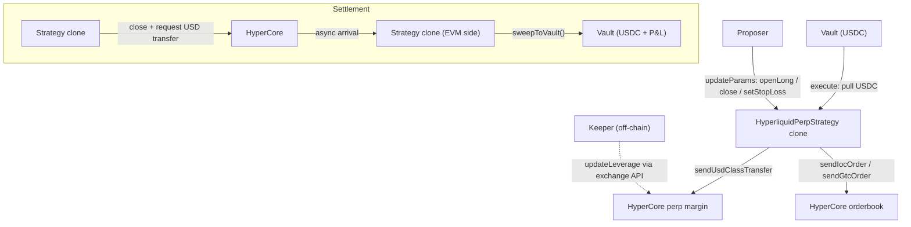

The `HyperliquidPerpStrategy` lets a syndicate run a leveraged perpetual position on Hyperliquid from an on-chain vault. USDC is pulled from the vault, transferred to HyperCore perp margin via the `L1Write` precompile, and the proposer drives trading actions (open long, update stop-loss, close position) through `updateParams`. Position state is read live from HyperCore via `L1Read.position2()` — nothing is cached on-chain.

HyperEVM mainnet only.

<Warning>
  This strategy holds leveraged positions on a centralized-matching venue. A liquidation on HyperCore permanently destroys vault equity up to the deposit amount. Use conservative `leverage`, set `maxPositionSize` and `maxTradesPerDay` at init, and monitor the position directly on Hyperliquid.
</Warning>

## Architecture



## Lifecycle

```
Pending → execute() → Executed → (trade actions)
        → initiateReturn() → wait ≥1 block → settle() → Settled → sweep
```

| Phase | What happens | Who calls |
|-------|-------------|-----------|
| **Execute** | Pull USDC from vault → bridge EVM→HC spot via Circle's `CoreDepositWallet.deposit` → `sendUsdClassTransfer` spot→perp. Leverage is set off-chain by the keeper via `updateLeverage` API call before the proposal opens — Hyperliquid's CoreWriter has no on-chain leverage action. | Governor (proposal execution) |
| **Executed** | Proposer opens/closes positions, updates stop-loss via `updateParams` | Proposer only |
| **Initiate return** (path 1) | Cancel stop-loss, force-close positions, queue perp→spot class transfer, queue spot→EVM bridge via `sendAsset` to USDC system address. Async — HC processes post-block; USDC arrives on the strategy's EVM address in the next block. | Proposer anytime; anyone after proposal duration expired |
| **Settle** (path 2) | Push the strategy's now-arrived EVM USDC to the vault. Governor's settle batch reads `vault.totalAssets()` for PnL math, so this is the moment NAV must be realized. If `initiateReturn()` was not called pre-settle, `_settle` falls back to a defensive in-call drain (USDC arrives next block — recover via `sweepToVault`). | Governor (proposal settlement) |
| **Sweep** | `sweepToVault()` pushes any latecomer USDC arrivals to the vault. Callable by anyone; repeatable for partial arrivals. | Anyone |

<Warning>
**Proposer must fund the strategy with HYPE on HyperCore before `initiateReturn`.** The spot→EVM `sendAsset` action consumes HC-side gas (HYPE), per [hyper-evm-lib's `bridgeToEvm` note](https://github.com/hyperliquid-dev/hyper-evm-lib/blob/main/src/CoreWriterLib.sol). If the strategy's HC HYPE balance is zero, the bridge action silently no-ops on HC and USDC stays on HC spot indefinitely. Recommended: send a small amount of HYPE (≤0.01 HYPE is sufficient for one bridge) to the strategy's HC address right after the clone is deployed and before `_execute` runs. Recovery from a HYPE-less stranded state: fund HYPE on HC, then call public `initiateReturn()` to retry the spot→EVM leg.
</Warning>

## Batch Calls

### Execute

```
[USDC.approve(strategy, depositAmount), strategy.execute()]
```

### Initiate return (off-batch, before settle)

```
strategy.initiateReturn()  // proposer or anyone-after-duration
```

Wait at least 1 block for HC to process the bridge actions, then run the settle batch.

### Settle

```
[strategy.settle()]
```

After `settle()`, anyone can call `strategy.sweepToVault()` to recover any HC arrivals that landed after the settle tx. Funds can only flow to the vault.

## InitParams

```solidity
(
  address asset,            // USDC on HyperEVM
  uint256 depositAmount,    // USDC to park as perp margin (fits in uint64)
  uint256 minReturnAmount,  // Min USDC sweep on settlement (InsufficientReturn revert)
  uint32  perpAssetIndex,   // HyperCore perp asset index (0 = BTC, 3 = ETH)
  uint32  leverage,         // 1–50
  uint256 maxPositionSize,  // Max USDC in a single position — on-chain hard cap
  uint32  maxTradesPerDay   // Rate limit on trading actions per day
)
```

On-chain risk caps:

- `leverage` must be 1–50
- Opening a position where `sz * limitPx / 1e6 > maxPositionSize` reverts with `PositionTooLarge`
- Exceeding `maxTradesPerDay` (counted per UTC day) reverts with `MaxTradesExceeded`
- At settlement, `sweepToVault()` reverts with `InsufficientReturn` if the arrived USDC is below `minReturnAmount`

## Proposer Actions (Executed state)

Encoded as `updateParams(abi.encode(action, ...))`:

| Action | Encoding | Description |
|--------|----------|-------------|
| `0` — update min return | `(uint8, uint256 newMinReturn)` | Lower the settlement floor. Does not count against daily trade limit. |
| `1` — open long | `(uint8, uint64 limitPx, uint64 sz, uint64 stopLossPx, uint64 stopLossSz)` | IOC long + optional GTC stop-loss. Stop-loss uses a fixed CLOID so each new one replaces the previous. |
| `2` — close position | `(uint8, uint64 limitPx, uint64 sz)` | IOC close — current design is long-only. |
| `3` — update stop-loss | `(uint8, uint64 triggerPx, uint64 sz)` | Cancel the current stop-loss and place a new GTC order. |

Position state is **not** tracked on-chain. Before acting, the proposer must read HyperCore directly (`L1Read.position2`). Funds never leave margin on trade actions — only `settle()` initiates the USD transfer back.

## Risk Notes

- **Liquidation:** HyperCore liquidates positions that breach maintenance margin. The on-chain contract has no view into liquidation state — settlement and sweep still work, but returned USDC may be well below `depositAmount`.
- **Async settlement:** `settle()` does not immediately return funds. The USD transfer from HyperCore to EVM is asynchronous; `sweepToVault()` may need to be called multiple times for partial arrivals.
- **No off-chain keeper:** All actions are on-chain through precompiles. There is no bot watching price — set stop-losses explicitly via action `3` if you want automated exits.
- **Long-only:** The current template opens and closes longs only. Short exposure requires a future template revision.

## CLI Usage

```bash
sherwood strategy propose hyperliquid-perp \
  --vault 0x... \
  --amount 5000 \
  --leverage 5 \
  --asset-index 3 \
  --min-return 4500 \
  --max-position 20000 \
  --max-trades-per-day 20 \
  --chain hyperevm \
  --name "ETH Perp 5x" \
  --performance-fee 2000 --duration 7d
```

| Flag | Description | Default |
|------|------------|---------|
| `--amount <n>` | USDC collateral to deploy | required |
| `--leverage <n>` | Leverage multiplier (1–50) | 10 |
| `--asset-index <n>` | HyperCore perp asset index | 0 (BTC) |
| `--min-return <n>` | Min USDC on sweep — reverts below this | — |
| `--max-position <amount>` | Max USD in a single position | 100000 |
| `--max-trades-per-day <n>` | Daily trading action limit | 50 |

After the proposal executes, drive trades with `sherwood proposal update-params` using the action encodings above.

## Addresses (HyperEVM)

| Contract | Address |
|----------|---------|
| HyperliquidPerpStrategy template | `0x1E831aB61Dc423bF678a2Ff8d9ce768E1e6D2338` |
| USDC | `0xb88339CB7199b77E23DB6E890353E22632Ba630f` |
| SyndicateFactory | `0x4085EEa1E6d3D20E84D8Ae14964FAb8b899DA40a` |
| SyndicateGovernor | `0x7B4a2f3480FE101f88b2e3547A1bCf3eaaDE46bc` |
