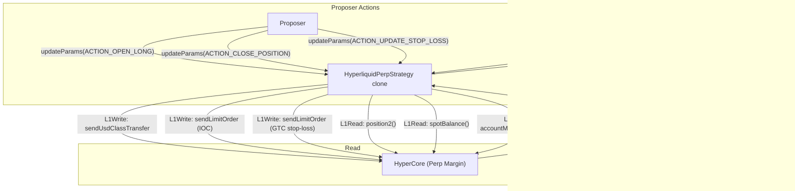

The `HyperliquidPerpStrategy` opens leveraged perpetual positions on Hyperliquid directly from a syndicate vault. It uses HyperEVM precompiles (`L1Write`, `L1Read`) for all trading actions — no off-chain keeper or relayer needed.

## Architecture



## Lifecycle

<Steps>
  <Step title="Proposal approved">
    Governor approves the proposal with encoded init params: `(asset, depositAmount, minReturnAmount, perpAssetIndex, leverage)`.
  </Step>
  <Step title="Execute">
    Vault calls `execute()`. Strategy pulls USDC, sets leverage on HyperCore, and transfers USDC to perp margin via `sendUsdClassTransfer`.
  </Step>
  <Step title="Trade">
    Proposer calls `updateParams()` with action-encoded data to open positions, set stop losses, close positions, or update min return.
  </Step>
  <Step title="Settle (Phase 1)">
    Vault calls `settle()`. Any open position is force-closed (IOC sell at minimum price). All perp margin is swept back to spot via `sendUsdClassTransfer`.
  </Step>
  <Step title="Sweep (Phase 2)">
    Proposer calls `sweepToVault()` in a separate transaction after USDC arrives on EVM side from the async HyperCore transfer. Enforces `minReturnAmount`.
  </Step>
</Steps>

## Parameters

| Parameter | Type | Description |
|-----------|------|-------------|
| `asset` | `address` | USDC address on HyperEVM |
| `depositAmount` | `uint256` | Amount to deposit into perp margin (6 decimals) |
| `minReturnAmount` | `uint256` | Minimum USDC that must be returned on settlement (enforced on-chain) |
| `perpAssetIndex` | `uint32` | Hyperliquid perp asset index (e.g., 3 = ETH) |
| `leverage` | `uint32` | Leverage multiplier (1x - 50x) |
| `maxPositionSize` | `uint256` | Maximum USDC in a single position |
| `maxTradesPerDay` | `uint32` | Maximum trading actions per UTC day |

## Action Types

The proposer controls the strategy via `updateParams(bytes data)` where the first ABI-encoded `uint8` is the action:

| Action | ID | Params | Description |
|--------|----|--------|-------------|
| Update Min Return | 0 | `(uint8, uint256)` | Change the minimum return threshold |
| Open Long | 1 | `(uint8, uint64, uint64, uint64, uint64)` | Place IOC buy + GTC stop-loss |
| Close Position | 2 | `(uint8, uint64, uint64)` | Cancel stop-loss + IOC sell |
| Update Stop Loss | 3 | `(uint8, uint64, uint64)` | Cancel old + place new GTC stop-loss |

## Settlement

Settlement uses `sendUsdClassTransfer` which is asynchronous (event-based):

1. `settle()`: Force-close any position, request USD transfer from perp to spot. Sets `settled = true`.
2. `sweepToVault()`: Callable by **anyone** after settle. Pushes USDC back to vault. First call enforces `minReturnAmount`. Can be called multiple times to handle partial async arrivals.

<Warning>
  `sweepToVault()` will revert with `InvalidAmount` if called before USDC arrives (zero balance), or `InsufficientReturn` on the first sweep if the balance is below `minReturnAmount`.
</Warning>

## On-Chain Risk Parameters

The strategy enforces two risk limits on-chain, immutable per proposal:

| Parameter | Description |
|-----------|-------------|
| `maxPositionSize` | Maximum USDC value in a single position. Reverts with `PositionTooLarge` if exceeded. |
| `maxTradesPerDay` | Maximum trading actions (open/close/update) per UTC day. Reverts with `MaxTradesExceeded` if exceeded. Counter resets at midnight UTC. |

These provide a safety floor regardless of off-chain agent configuration.

## Order Tracking (CLOIDs)

The strategy uses a single fixed CLOID for the GTC stop-loss order. Only one stop-loss is ever live — each new one cancels the previous before placing a replacement. This keeps gas cost O(1) regardless of trade history.

## View Functions

| Function | Returns | Description |
|----------|---------|-------------|
| `getPosition()` | `Position` | Current perp position from HyperCore |
| `getSpotBalance()` | `SpotBalance` | USDC spot balance on HyperCore |
| `getMarginSummary()` | `AccountMarginSummary` | Account margin summary |

## Deployment

The strategy template is deployed on HyperEVM (chain 999) via `DeployTemplates.s.sol`. It is ERC-1167 clonable — each proposal creates a fresh clone with its own storage.

```bash
sherwood strategy propose hyperliquid-perp \
  --vault 0x... \
  --amount 10000 \
  --min-return 9900 \
  --asset-index 3 \
  --leverage 5
```
