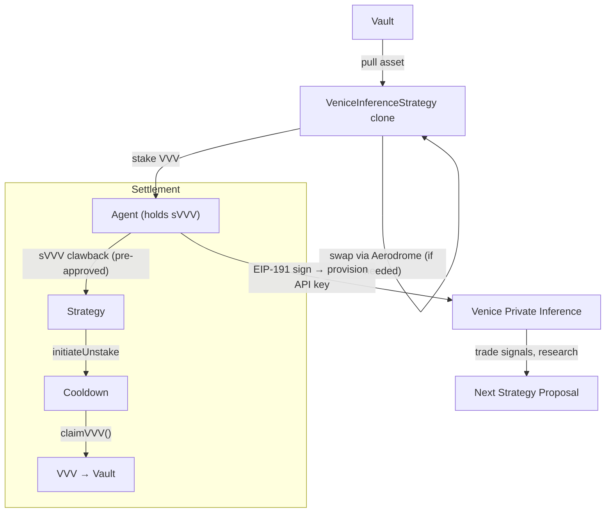

The `VeniceInferenceStrategy` stakes VVV for sVVV to a single agent, enabling private AI inference through Venice. It's an ERC-1167 clonable template — any syndicate, any agent, any proposal can use it as a lego block.

## Architecture



## Two Execution Paths

The strategy supports both paths, determined at initialization by whether `asset == vvv`:

<CardGroup cols={2}>
  <Card title="Direct Path" icon="bolt">
    Vault already holds VVV. Strategy pulls VVV and stakes directly to the agent.
    No router, no factory, no slippage params needed.
  </Card>
  <Card title="Swap Path" icon="arrows-rotate">
    Vault holds USDC or another asset. Strategy swaps to VVV via Aerodrome Router,
    then stakes. Supports single-hop (asset → VVV) and multi-hop (asset → WETH → VVV).
  </Card>
</CardGroup>

## Lifecycle

```
Pending → execute() → Executed → settle() → Settled → claimVVV() → VVV returned
```

| Phase | What happens | Who calls |
|-------|-------------|-----------|
| **Execute** | Pull asset from vault → [swap to VVV if needed] → stake to agent | Governor (proposal execution) |
| **Settle** | Claw back sVVV from agent → initiate unstake (cooldown begins) | Governor (proposal settlement) |
| **Claim** | Finalize unstake after cooldown → push VVV back to vault | Anyone (`claimVVV()`) |

<Warning>
Settlement initiates unstaking but does not return VVV immediately. Venice staking has a cooldown period.
After cooldown elapses, anyone can call `claimVVV()` on the strategy to finalize the unstake and push VVV back to the vault.
</Warning>

## Batch Calls

### Execute

```
[asset.approve(strategy, assetAmount), strategy.execute()]
```

### Settle

```
[strategy.settle()]
```

### Post-Settlement Claim

```
strategy.claimVVV()  // after cooldown — callable by anyone
```

## InitParams

```solidity
struct InitParams {
    address asset;        // Token pulled from vault (VVV or USDC)
    address weth;         // For multi-hop swap (ignored if direct or singleHop)
    address vvv;          // VVV token
    address sVVV;         // Venice staking contract (also ERC-20)
    address aeroRouter;   // Aerodrome router (address(0) if direct)
    address aeroFactory;  // Aerodrome factory (address(0) if direct)
    address agent;        // Agent wallet receiving sVVV
    uint256 assetAmount;  // Amount of asset to pull
    uint256 minVVV;       // Min VVV from swap (0 if direct)
    uint256 deadlineOffset; // Swap deadline in seconds (default 300)
    bool singleHop;       // True for direct asset→VVV swap
}
```

### Direct Path Example

```solidity
VeniceInferenceStrategy.InitParams memory p = VeniceInferenceStrategy.InitParams({
    asset: vvv,             // asset == vvv → direct path
    weth: address(0),
    vvv: vvv,
    sVVV: sVVV,
    aeroRouter: address(0), // not needed
    aeroFactory: address(0),
    agent: agentWallet,
    assetAmount: 1000e18,
    minVVV: 0,              // not needed
    deadlineOffset: 0,
    singleHop: false
});
```

### Swap Path Example

```solidity
VeniceInferenceStrategy.InitParams memory p = VeniceInferenceStrategy.InitParams({
    asset: usdc,
    weth: weth,
    vvv: vvv,
    sVVV: sVVV,
    aeroRouter: 0xcF77a3Ba9A5CA399B7c97c74d54e5b1Beb874E43,
    aeroFactory: 0x420DD381b31aEf6683db6B902084cB0FFECe40Da,
    agent: agentWallet,
    assetAmount: 500e6,      // 500 USDC
    minVVV: 900e18,          // slippage floor
    deadlineOffset: 300,
    singleHop: false         // USDC → WETH → VVV
});
```

## Agent Pre-Approval

The agent **must** call `sVVV.approve(strategy, amount)` before proposal creation. ERC20 `approve` works before holding tokens — the agent doesn't need sVVV to approve the clawback.

## API Key Provisioning

After execution, the agent provisions a Venice API key:

1. GET validation token from `https://api.venice.ai/api/v1/api_keys/generate_web3_key`
2. Sign token with agent wallet (EIP-191)
3. POST signed token → receive INFERENCE API key

<Info>
Venice requires the **signing wallet to hold sVVV**. It does not support EIP-1271 (contract signatures), so the vault cannot provision keys. Each agent must hold their own sVVV.
</Info>

## Tunable Parameters

While in `Executed` state, the proposer can update swap params:

| Parameter | Description |
|-----------|-------------|
| `minVVV` | Minimum VVV output from swap (slippage protection) |
| `deadlineOffset` | Seconds added to `block.timestamp` for swap deadline |

```solidity
strategy.updateParams(abi.encode(newMinVVV, newDeadlineOffset));
// Pass 0 to keep current value
```

## CLI Commands

```bash
sherwood venice fund --vault 0x... --amount 500 --execute        # fund agents directly
sherwood venice fund --vault 0x... --amount 500 --write-calls .   # export for proposals
sherwood venice provision                                          # provision API key
sherwood venice status --vault 0x...                               # check balances + key
sherwood venice models                                             # list inference models
sherwood venice infer --model <id> --prompt "..."                  # private inference
```

## Addresses (Base Mainnet)

| Contract | Address |
|----------|---------|
| VVV Token | `0xacfe6019ed1a7dc6f7b508c02d1b04ec88cc21bf` |
| Venice Staking (sVVV) | `0x321b7ff75154472b18edb199033ff4d116f340ff` |
| DIEM | `0xF4d97F2da56e8c3098f3a8D538DB630A2606a024` |
| Aerodrome Router | `0xcF77a3Ba9A5CA399B7c97c74d54e5b1Beb874E43` |
| Aerodrome Factory | `0x420DD381b31aEf6683db6B902084cB0FFECe40Da` |
